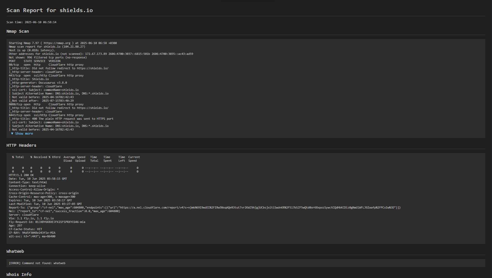

# 🔎AutoRecon

**AutoRecon** is an automated server and domain reconnaissance utility designed for penetration testers and security specialists. The script launches popular reconnaissance tools, collects the results, and displays them in a user-friendly HTML report with dynamic updates directly in your browser.

---

## 📕Features

- **Automated execution of multiple scanners and utilities**
- **Dynamic HTML report updates** — results appear as commands execute, no page refresh needed
- **Automatic launch of a local HTTP server and opening the report in the browser**
- **Cross-platform compatibility** — works on Windows and Linux (given the necessary utilities are installed)
- **Convenient result storage structure** — everything is saved into folders for each target

---

## 🛠️Tools Used

AutoRecon runs the following tools (if they are installed and available in your PATH):

| Tool           | Purpose                                           |
|----------------|---------------------------------------------------|
| **nmap** | Port and service scanning                         |
| **whatweb** | Web technology identification                     |
| **whois** | Whois information for domains                     |
| **amass** | Subdomain enumeration                             |
| **theHarvester**| Gathering emails, names, domains from public sources|
| **dnsrecon** | DNS reconnaissance                                |
| **sslscan** | SSL/TLS analysis                                  |
| **curl -I** | Retrieving HTTP headers                           |
| **nikto** | Web server vulnerability scanning                 |
| **gobuster** | Brute-forcing directories and files on a web server|
| **nuclei** | Fast vulnerability scanning using templates       |
| **subfinder** | Fast subdomain enumeration                        |

> **Note:** If a tool is not installed, the report will show `[ERROR] Command not found: ...`

---

## 📨How Dynamic Updates Work

- After the script starts, a local HTTP server automatically launches (by default on port 8765).
- The HTML report (`report.html`) opens in your browser and automatically fetches fresh results from `results.json` every 2 seconds.
- As soon as a scanner finishes, its output immediately appears in the report — the page updates **without reloading**.

---

## ✅Installation and Running

1.  **Install necessary tools**
    Ensure the required utilities (listed above) are installed and available in your PATH variable.

2.  **Clone the repository**
    ```sh
    git clone https://github.com/hiitaro/AutoRecon.git
    cd AutoRecon
    ```
3.  **📦 Requirements**
    ```sh
    pip install -r requirements.txt
    ```
    
4.  **Run the script**
    ```sh
    python autorecon.py <target>
    ```
    where `<target>` is an IP address or domain name.

5.  **A browser will open with the report**
    If it doesn't open automatically, navigate to:
    [http://localhost:8765/report.html](http://localhost:8765/report.html)

---

## 💻️Example Usage



---

## Configuring Command Flags

You can easily customize the flags and parameters for each tool by editing the `flags.json` file in the project root.  
Only the tools listed in `flags.json` will be executed. If you remove a tool from the file, it will not run.

**Example `flags.json`:**
```json
{
    "Nmap Scan": "-sC -sV",
    "HTTP Headers": "-I",
    "WhatWeb": "",
    "Whois Info": "",
    "Amass Enum": "enum -d",
    "theHarvester": "-d {target} -b all",
    "DNSRecon": "-d",
    "SSLScan": "",
    "Nikto Scan": "-h",
    "Gobuster Scan": "dir -u {url} -w /usr/share/wordlists/dirb/common.txt",
    "Nuclei Scan": "-u {url} -silent",
    "Subfinder": "-d"
}
```

- Use `{target}` and `{url}` as placeholders; they will be replaced automatically.
- To disable a tool, simply remove its entry from `flags.json`.
- Changes take effect on the next script run.

This makes it easy to tailor the scan to your needs without editing the main Python code.

---

## 📄Notes

-   **Stopping:** To stop the script and HTTP server, press `Ctrl+C` in the terminal.
-   **Cross-Platform:** The script works on Windows and Linux, but the set of available utilities may differ.
-   **Security:** Only use this on your own resources or with explicit permission from the owner!

---

## 🔧️Extending

You can easily add your own commands or tools — just append them to the `commands` dictionary in the `autorecon.py` file:

```python
commands = {
    "Nmap Scan": f"nmap -sC -sV {target}",
    "HTTP Headers": f"curl -I {'https' if protocol == 'https' else 'http'}://{target}",
    "WhatWeb": f"whatweb {'https' if protocol == 'https' else 'http'}://{target}",
    "Whois Info": f"whois {target}",
    "Amass Enum": f"amass enum -d {target}",
    "theHarvester": f"theHarvester -d {target} -b all",
    "DNSRecon": f"dnsrecon -d {target}",
    "SSLScan": f"sslscan {target}",
    "Nikto Scan": f"nikto -h https://{target}" if protocol == "https" else f"nikto -h http://{target}",
    "Gobuster Scan": f"gobuster dir -u {'https' if protocol == 'https' else 'http'}://{target} -w /usr/share/wordlists/dirb/common.txt",
    "Nuclei Scan": f"nuclei -u {'https' if protocol == 'https' else 'http'}://{target} -silent",
    "Subfinder": f"subfinder -d {target}"
    }
```

---

**AutoRecon** - your quick start for server reconnaissance and auditing!


